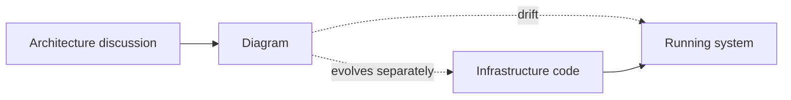
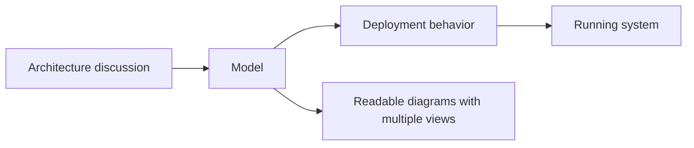

# The gap

- diagrams drift away from running systems
- architecture and delivery evolve separately
- one abstraction level is never enough
- discussions stay clean, implementation gets messy

<!--
This is the compressed version of the opening problem.

The core issue is not that diagrams exist.
The issue is that they drift away from what is actually running.

And that happens for two reasons at once.
Architecture discussions and delivery evolve separately.
And one abstraction level is never enough.

So the high-level view stays useful for conversation,
but the real implementation keeps accumulating details somewhere else.

That is the gap I wanted to reduce.
-->

---

# Why the old path was not enough

### What kept breaking

- static diagrams were too easy to neglect
- high-level diagrams were not actionable enough
- detailed diagrams were not readable enough
- docs and IaC drifted independently

### Why I changed the stack

- `PlantUML` was not the right fit for this modeling problem
- `CDKTF` needed replacement anyway
- a real delivery problem was the best way to learn the next IaC stack

<!--
This slide is the short explanation of why I did not want to continue with the previous path.

Static diagrams depended only on discipline.
If nobody updated them, they drifted.

And the abstraction level was unstable.
If the diagrams stayed high-level, they were good for presentations but weak for delivery.
If they became detailed, they stopped being useful in discussions.

At the same time, I already needed to move off the previous IaC path anyway.
So instead of doing a narrow migration, I used that moment to rethink the whole workflow.
-->

---

# What I wanted instead

- readable diagrams for real discussions
- a shared model close enough to deployment to matter
- less translation loss between design and implementation
- a supported modern IaC stack
- something reusable and extensible, not a one-off script

<!--
This is the distilled target state.

I still wanted diagrams that people could read and discuss.
But I also wanted a shared model that was close enough to deployment to influence real behavior.

That means less translation loss,
a supported modern IaC stack,
and an approach that could be reused or extended later.

At the same time, I was not trying to generate everything from diagrams or eliminate infrastructure code.
The goal was a better connection between architecture and delivery.
-->
