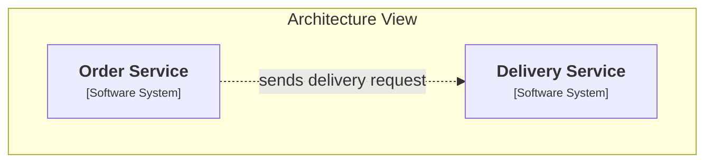
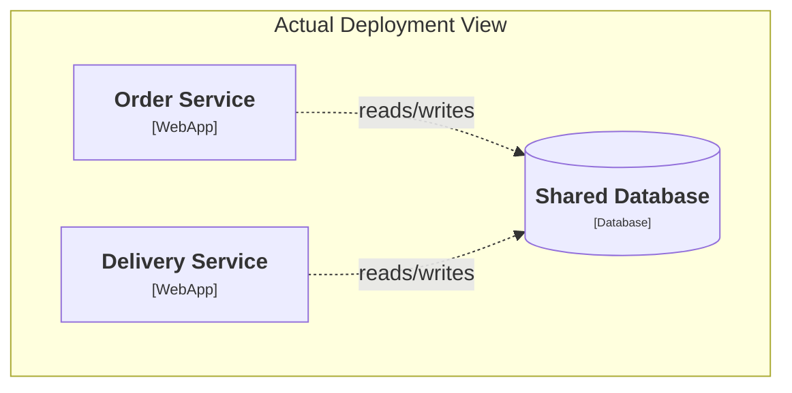

# Problem

- diagrams drift away from reality
- some diagrams are outdated
- some diagrams were never implemented as designed
- architecture discussions and delivery gradually diverge

 
 

<!--
The first problem is simple: diagrams drift away from reality.

I think most people in the room have seen this before.
There is a diagram somewhere in Confluence, Git, Miro, or in a repository.
People still bring it into meetings.
But nobody is fully sure whether it still reflects what is actually running.

And I have seen both versions of this problem.
Sometimes the diagram was correct once and then became outdated.
Sometimes the system was never implemented exactly the way the diagram suggested in the first place.

So the problem is not that diagrams are useless.
The problem is that once they are disconnected from delivery, they slowly become optional.

The simple picture on this slide shows the intended flow from architecture idea to running system.
The dashed line highlights the real issue: the diagram and the running system are no longer guaranteed to match.

The one sentence I want to land here is this:
If a diagram is not connected to implementation, it eventually becomes a suggestion rather than a source of truth.
-->

---

# Cost

- architecture reviews are based on assumptions
- onboarding becomes slower
- implementation details dominate design discussions
- diagrams are often ignored because they are not reliable

### Typical meeting

- "Is this diagram still valid?"
- "I think the queue is actually different"
- "This dependency is missing"
- "The deployment does not really look like this"

### Practical impact

- weaker design decisions
- more translation loss between roles
- more time spent rediscovering the system
- less confidence in documentation

<!--
This is where the abstract problem turns into actual cost.

When diagrams are unreliable, architecture reviews are based on assumptions.
People first spend time checking whether the diagram is still valid before they can even discuss the decision itself.

Onboarding also gets slower.
New engineers cannot trust the documentation, so they have to reconstruct the system from code, deployments, and tribal knowledge.

And then something more subtle happens.
Because the high-level view is no longer trusted, design discussions get dragged into low-level implementation details.

On the left are the kinds of phrases we hear in meetings.
On the right is what the organization actually pays for.

For me, the key point is this:
the problem is not only bad diagrams.
The real problem is loss of trust in architecture as a working artifact.

And once that trust is gone, teams stop maintaining diagrams even more, so the drift only accelerates.
-->

---

# Example

### The gap I wanted to close

- keep diagrams useful for communication
- make them close enough to deployment to stay current
- reduce translation loss between architecture and implementation

 

### Diagram used in discussions

### What the real deployment looks like

<!--
Here I want to show one diagram that is good for discussion and compare it with what the real deployment actually looks like.

The point is not that the diagram must contain every infrastructure detail.
I do not want diagrams to become raw cloud inventory dumps.

But I also do not want them to be disconnected from reality.
What I wanted was something in between:
diagrams that stay readable for communication, but stay close enough to deployment to remain relevant.

That was the gap I wanted to close.

And that leads directly to the next question:
why were the previous tools and approaches not enough for me?
-->
