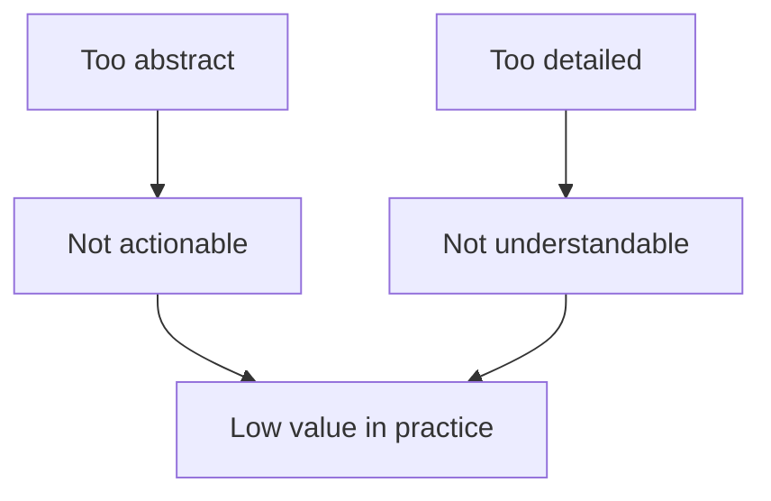
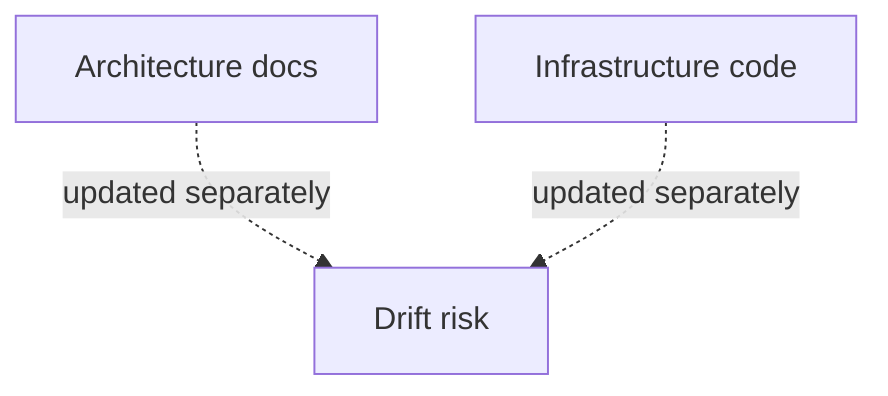

# Why

- static diagrams were too easy to neglect
- one level of detail was never enough
- the tooling I had before was no longer a good long-term path
- I wanted a real delivery problem to drive the next IaC learning step

 

<!--
So the next question for me was: why not just continue with the older way of doing architecture and IaC?

The answer is that I had several different pressures at the same time.
Not just one.

First, static diagrams were too easy to neglect.
They depended only on discipline.
There was no delivery feedback loop forcing them to stay aligned.

Second, one level of detail was never enough.
If the diagram stayed high-level, it was good for presentations but weak for delivery.
If it became too detailed, it stopped being useful for communication.

That is what the small diagram is trying to show.
Two opposite failure modes, but the same end result: low practical value.

The main point I want to make here is this:
the problem was not that diagrams existed.
The problem was that the useful abstraction level was unstable.
-->

---

# Limits of the old path

- `PlantUML` was not a good fit for multi-level architecture modeling in this case
- `CDKTF` had to be replaced anyway because support ended
- learning a new IaC stack through a real use case was better than learning in isolation

 

<!--
Here I want to explain the limits of the path I was already on, without turning this into a tool war.

About PlantUML: I am not saying PlantUML is bad.
I am saying it was not the right fit for what I wanted in this case.
I needed something that supported multiple useful abstraction levels better, and I wanted a more model-first approach rather than only drawing syntax.

About the IaC side: I also had a practical reason to rethink the stack.
I already needed to move to a supported modern IaC approach anyway.
So instead of doing a narrow migration, I used that moment to reconsider the whole workflow.

And there was one more motivation.
Learning a new IaC stack through a real problem is much more valuable than learning it in isolation.

The diagram on this slide expresses a different kind of drift.
Architecture docs, infrastructure code, and the running system often evolve separately.
And once they evolve separately, drift becomes the default outcome.

That is the gap I wanted to shrink.
-->

---

# Not enough

### What I did not want

- diagrams that are only presentation material
- IaC that has no architectural context
- a migration that only swaps one tool for another

### What I needed instead

- a model that remains useful in discussions
- a path from model to deployment behavior
- a better feedback loop between design and implementation

 

### What I concluded

- I did not need a prettier diagramming syntax
- I needed a better connection between architecture and delivery
- I wanted the next IaC step to solve a real communication problem, not only a tooling problem

<!--
This slide closes the section by separating what I did not want from what I actually needed.

I was not looking for a prettier diagramming syntax.
And I was not looking for a migration that only swaps one infrastructure tool for another.

What I needed was a better connection between architecture and delivery.
I wanted a model that stays useful in discussions, but can also influence deployment behavior.

So this is the conclusion of the section:
I did not need a nicer diagram.
I needed a better workflow.

And once that became clear, the next step was to define the goals before choosing the actual shape of the solution.
-->
