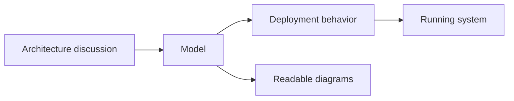

# Goals

- reduce diagram-to-reality drift
- keep diagrams useful in architecture discussions
- make the model close enough to delivery to matter
- avoid monolithic IaC for the whole system

<!--
Now I want to define what success should look like.

I tried to keep these goals practical.
Not vague goals like "better architecture", but goals I could actually design around.

First, I wanted to reduce diagram-to-reality drift.
Not to magically eliminate all drift forever, but to reduce it structurally.

Second, I wanted diagrams to remain useful in architecture discussions.
They still had to be readable by humans.

Third, I wanted the model to be close enough to delivery to matter.
It had to influence what gets deployed, not just describe it from a distance.

And finally, I wanted whole-system visibility without forcing one giant monolithic IaC codebase.

The small diagram on this slide shows the key idea:
the same model should support discussion and also influence deployment behavior.
That dual role is central to the whole talk.
-->

---

# Also

- choose a supported modern IaC stack
- learn through real implementation, not through isolated exercises
- make the approach reusable by other teams later
- keep the system extensible instead of provider-locked or pattern-locked

### Reuse later

- base conventions
- ready-made patterns
- lower entry cost for other teams

### Extend later

- provider-specific packages
- custom components
- organization-specific abstractions

<!--
These are the secondary goals, but they were still important.

I also needed to choose a supported modern IaC stack.
And I wanted to learn it through a real implementation, not through isolated examples.

At the same time, I wanted the result to have some future reuse value.
Not because it was already a finished platform, but because I wanted the direction to be reusable later.

That is why this slide has two columns.
One is about reuse: conventions, ready-made patterns, lower entry cost for other teams.
The other is about extensibility: provider-specific packages, custom components, and organization-specific abstractions.

I should mention that Azure is only the first provider implementation in my case.
It is not meant to be the hard architectural boundary of the idea.
-->

---

# Non-goals

- not to generate every possible cloud resource from diagrams
- not to remove the need for IaC
- not to force one modeling style for all teams

### Success for this PoC means

- the model can drive meaningful deployment behavior
- the abstraction removes real boilerplate
- the solution stays understandable and extensible

<!--
There are a few things I am explicitly not trying to do.
I am not trying to generate every possible cloud resource from diagrams.
I am not trying to remove the need for infrastructure code.
And I am not trying to force one modeling style on every team.

For me, success means three things:
the model can drive meaningful deployment behavior,
the abstraction removes real boilerplate,
and the result stays understandable and extensible.

So with those goals and non-goals in place, I could shape the solution around a simple idea:
make the architecture model executable enough to influence deployment.
-->
