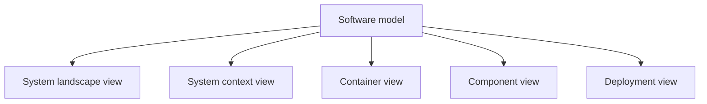
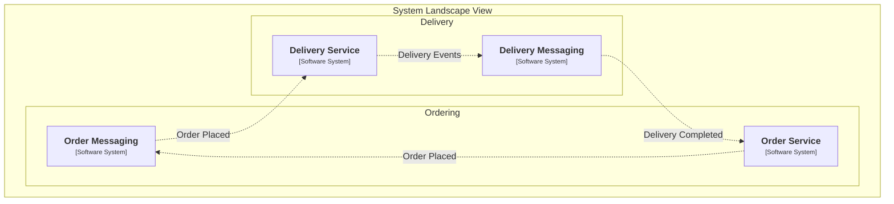
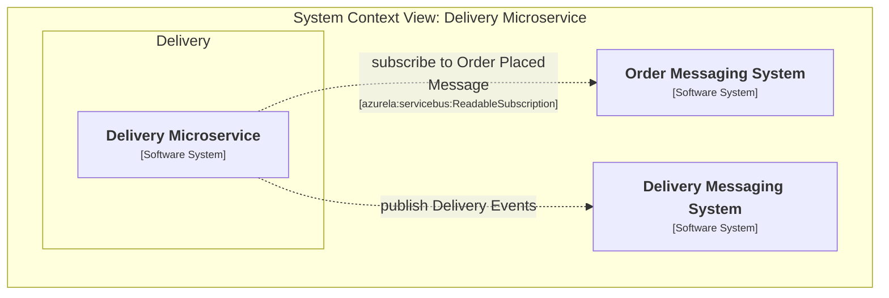
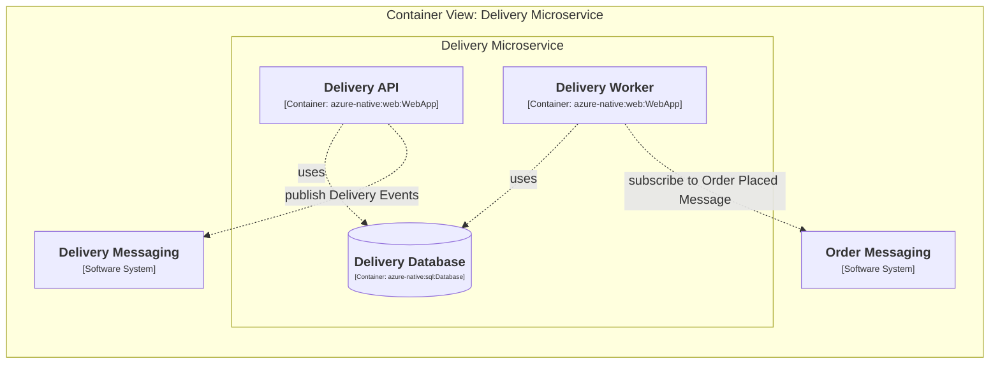
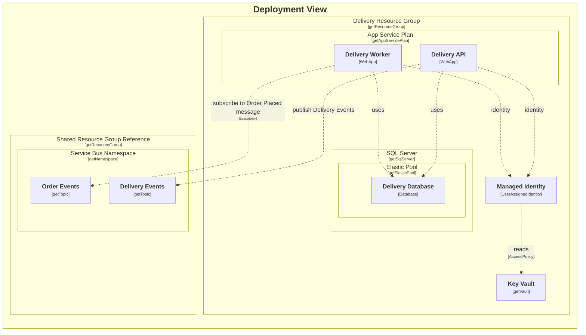

# Structurizr

- `C4` is the modeling approach
- `Structurizr` is the tooling ecosystem built around that approach
- it works with a software model, not only with drawing syntax
- one model can produce multiple views

 

<!--
So what have I chose to solve diagramming problem.
- C4 is the architectural modeling approach.
- Structurizr is the tooling ecosystem built around that approach.

The software model is in the middle, and different views are derived from it.
So instead of maintaining unrelated diagrams by hand, I can keep one underlying model and use different views for different conversations.

For my use case, that was a big improvement, because one of the earlier problems was exactly this instability of abstraction level.
With Structurizr, I could keep different levels of detail without treating them as completely separate artifacts.
-->

---

# Why it fit

- better support for multiple useful abstraction levels
- model-first instead of diagram-text-first
- deployment views are part of the same modeling world
- elements and relationships can carry metadata, not only labels

### What I needed

- readable architecture views
- different zoom levels
- a deployment-oriented view
- a model that can be processed later

### What Structurizr gave me

- C4-style views
- one shared model behind them
- deployment views
- properties on nodes and relationships

<!--
This slide explains why Structurizr was a better fit for my problem.

The biggest point is that it is model-first.
I am not only writing text that renders into a picture.
I am working with a model that can later be inspected, transformed, and processed.

That part is especially important for this talk, because my whole approach depends on the model being more than presentation material.

Another important point is deployment views.
I did not want architecture on one side and deployment topology on another side with no shared backbone. I wanted them to live in the same modeling world.

And finally, elements and relationships can carry properties.
That becomes very important later, because those properties are exactly what I use to attach deployment meaning to the model.
-->

---

# System Landscape view

<!--
Here I want to start from the widest view.
This is the level where I can explain where the system lives in the broader landscape.

At this level I am not discussing infrastructure details yet.
I am showing the main systems, their roles, and the most important interactions.

This view is useful because it gives people orientation.
Before discussing deployment, before discussing containers, I want everyone to understand the system boundary and its neighbors.

This is also a good reminder of why I chose the C4 approach with Structurizr in the first place.
I do not need one overloaded diagram that tries to answer every question at once.
I can start wide and then zoom in.

So after this landscape view, the next natural step is to zoom into one specific system and first look at its system context.
-->

---

# System Context view

<!--
Now I zoom in from the landscape to one specific system.
This is the level where I can show the chosen system boundary more clearly and make its immediate neighbors explicit.

So compared to the landscape view, this is already more focused.
I am no longer showing the whole surrounding world.
I am showing one system, the external systems around it, and the most important interactions across that boundary.

And again, this is still the same underlying model.
I am not redrawing the architecture from scratch.
I am just looking at the next level of detail.

After this, I can zoom in once more and look at the main containers inside the system.
-->

---

# Container view

<!--
At the container level I can discuss the main building blocks of the system itself.

This is usually the most useful level for architecture discussions with developers and architects.
It is detailed enough to talk about responsibilities and interactions, but still abstract enough to stay readable.

For me this level was especially important because it is often the sweet spot.
System context is sometimes too far away, and deployment view is already too operational.
Container view is where architecture discussion is often the most productive.

And importantly, this is still the same underlying model.
I am not switching to a completely separate artifact.

After this, I can switch perspective and show how the same model can also be represented in deployment terms.
-->

---

<!-- #### Deployment View-->

<!--
This is the final perspective I want to show in this section.
Now the same modeling approach starts speaking in deployment terms.

This is important because the whole point of my work was not only to have nice architecture diagrams.
I wanted a model that could move closer to delivery without becoming a completely different thing.

So I could keep diagrams readable for people.
I could still keep them connected to a structured model.
And that model was rich enough to become input for the deployment engine.

I can also make one limitation clear here.
Structurizr still does not deploy infrastructure by itself.
It gives me the model and the views.
But to turn that into actual infrastructure behavior, I still need another piece.

And that is exactly the bridge to the next section.
Structurizr gave me the model.
Pulumi gave me the execution layer.
-->
