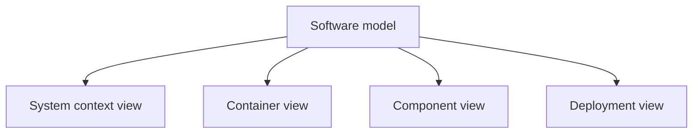
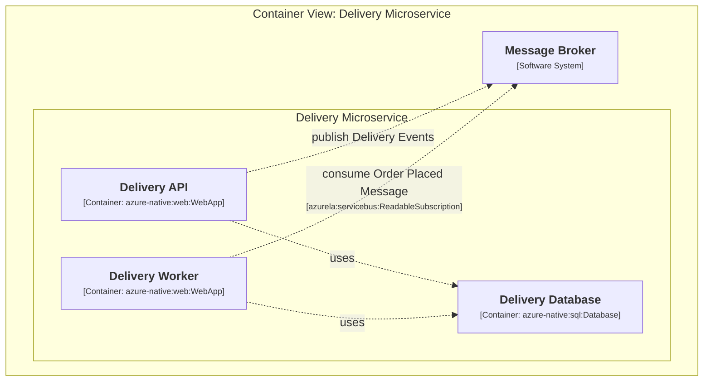
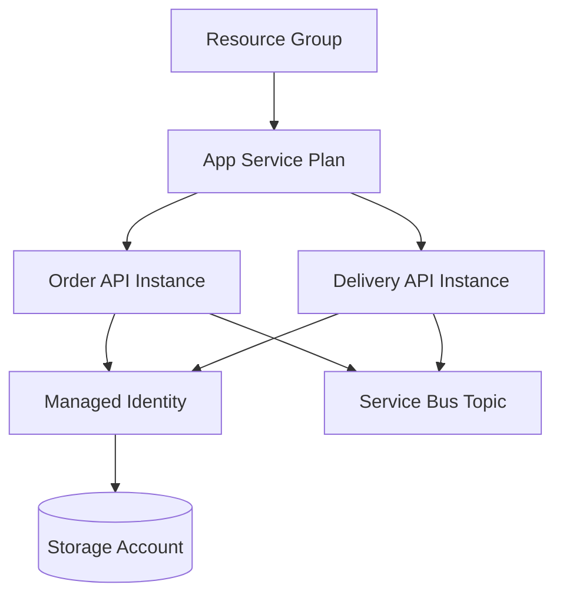

# Structurizr

- `C4` is the modeling approach
- `Structurizr` is the tooling ecosystem built around that approach
- it works with a software model, not only with drawing syntax
- one model can produce multiple views

<!--
So what have I chose to solve diagramming problem.
C4 is the architectural modeling approach.
Structurizr is the tooling ecosystem built around that approach.

The software model is in the middle, and different views are derived from it.
So instead of maintaining unrelated diagrams by hand, I can keep one underlying model and use different views for different conversations.

For my use case, that was a big improvement, because one of the earlier problems was exactly this instability of abstraction level.
With Structurizr, I could keep different levels of detail without treating them as completely separate artifacts.
-->

---

# Why it fit

- better support for multiple useful abstraction levels
- model-first instead of diagram-text-first
- deployment views are part of the same modeling world
- elements and relationships can carry metadata, not only labels

### What I needed

- readable architecture views
- different zoom levels
- a deployment-oriented view
- a model that can be processed later

### What Structurizr gave me

- C4-style views
- one shared model behind them
- deployment views
- properties on nodes and relationships

<!--
This slide explains why Structurizr was a better fit for my problem.

I do not need to oversell it here.
I only need to explain why it matched my needs better than a plain diagramming syntax.

The biggest point is that it is model-first.
I am not only writing text that renders into a picture.
I am working with a model that can later be inspected, transformed, and processed.

That part is especially important for this talk, because my whole approach depends on the model being more than presentation material.

Another important point is deployment views.
I did not want architecture on one side and deployment topology on another side with no shared backbone.
I wanted them to live in the same modeling world.

And finally, elements and relationships can carry properties.
That becomes very important later, because those properties are exactly what I use to attach deployment meaning to the model.
-->

---

# In practice

### Architecture discussion

### Deployment-oriented view

### Why this mattered to me

- I could keep diagrams readable for people
- I could still keep them connected to a structured model
- that model was rich enough to become input for the deployment engine

<!--
On the left is the kind of view that is useful in architecture discussions.
It focuses on the main containers and interactions.
On the right is a deployment-oriented view.
It is still readable, but it already starts to speak in terms of real deployed building blocks.

The point is not only that Structurizr supports multiple views in theory.
The point is that I can use different views for different conversations while still keeping one underlying model.

And that is exactly what I needed.
I still wanted diagrams that people could look at in meetings.
But I also wanted the underlying model to be structured enough to feed into automation.

I can also make one limitation clear here.
Structurizr is still not the same as a fully parametric component system.
So I am not claiming it solved every modeling problem I have ever had.

But for this use case, it gave me something much more important:
a clean architectural model that I could later connect to deployment behavior.

And that leads directly to the next section.
Structurizr gave me the model, but it does not deploy infrastructure by itself.
So the next piece of the story is Pulumi.
-->
