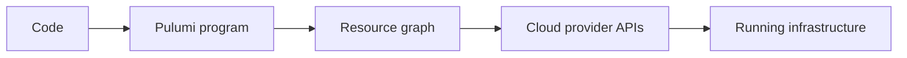
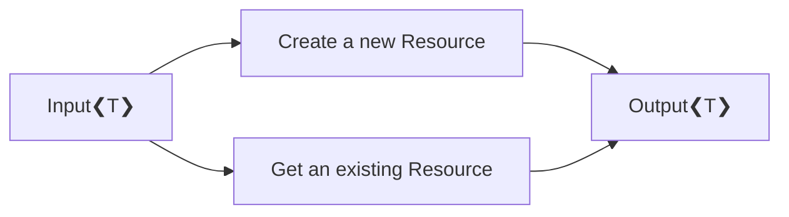
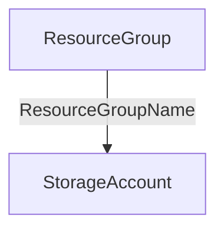
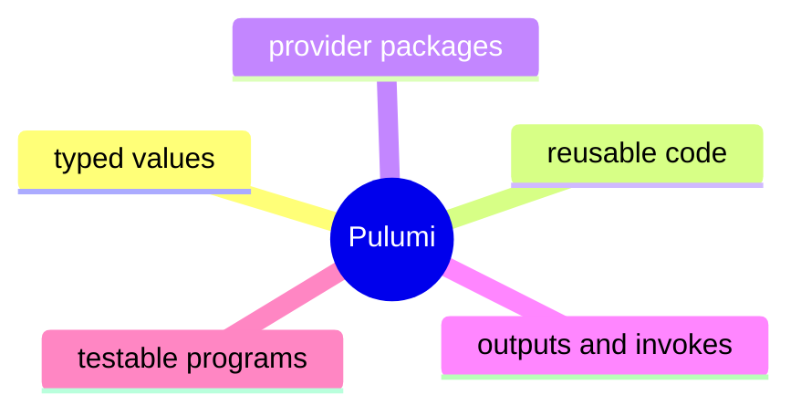

# Pulumi

- `Pulumi` is an Infrastructure as Code platform
- it lets you define cloud resources in a general-purpose language
- infrastructure becomes code, not a separate templating DSL
- the same program can describe resources, dependencies, and configuration

<br/><br/>



<!--
First I want to introduce Pulumi on its own.

The simplest way I explain it is this:
Pulumi is an Infrastructure as Code platform that lets me define infrastructure in a normal programming language.

So instead of writing only a specialized infrastructure DSL, you can use code to describe resources, dependencies, and configuration.

The small diagram on this slide shows the mental model I want the audience to keep.
You write code, Pulumi evaluates it as a program, builds a resource graph, and then talks to the cloud provider APIs to converge the real infrastructure.

What matters here is that Pulumi is not just text templating.
It is an execution model for infrastructure.
-->

---

# Core concepts

<div class="grid grid-cols-2 gap-6 mt-4">
<div>

### Main building blocks

- New resource
- Input
- Output
- Existing resource
- Stack

</div>
<div>

### Practical meaning

- something to create or manage
- a value passed into a resource
- a value produced by a resource
- read existing infrastructure
- one deployed environment and its state

</div>
</div>
<br/>



<!--
Here I want to make Pulumi concrete without going too deep yet.

These are the concepts I think are enough for the rest of the talk.
A resource is the cloud object I want to create or manage.
An input is a value passed into it.
An output is a value it produces after deployment.
And invoke functions read information about infrastructure that already exists.

The reason this matters for me is that Pulumi treats value flow explicitly.
Inputs flow into resources, and outputs flow out of resources.
That is one of the most important ideas for the next part of the presentation.
-->

---

# How Pulumi handles dependencies

- dependencies can be declared explicitly
- but they are often inferred from value flow
- if one resource uses another resource's output, Pulumi understands the order
- this keeps the code closer to the actual dependency graph

<div class="grid grid-cols-2 gap-6 mt-4">
<div>

``` cs
var rg = new ResourceGroup("rg", new ResourceGroupArgs
{
    ResourceGroupName = "example-rg",
    Location = "westeurope"
});

var sa = new StorageAccount("sa", new StorageAccountArgs
{
    AccountName = "examplesa",
    ResourceGroupName = rg.Name,
    // ...
});
```

</div>
<div>



</div>
</div>

<!--
This is the Pulumi idea I especially want to highlight before I move on.

Pulumi does support explicit dependencies, but very often you do not have to declare them manually.
If one resource consumes another resource's output, Pulumi can infer that dependency from the value flow.

That is important because it means the infrastructure graph is reflected in the program structure.
You are not only listing resources one after another.
You are wiring values between them, and Pulumi can use that to understand ordering.

Pulumi is useful not only because it creates resources, but because it models relationships between them through typed values.
-->

---

# Why I found it attractive

<div class="grid grid-cols-2 gap-4 mt-4 items-center">
<div>

- strong typing in `C#`
- real reuse through classes, methods, and packages
- access to provider invokes and outputs
- normal testing and debugging tools
- a good learning step from earlier IaC approaches

</div>



</div>

<!--
This slide is where I summarize why Pulumi attracted me before I even connected it with Structurizr.

I liked that it was strongly typed in C#.
I liked that I could reuse normal code instead of only copying infrastructure snippets.
I liked that cloud providers were exposed through packages with resources, invokes, inputs, and outputs.
And I liked that I could test and debug things with normal language tooling.

I also want to be honest here.
Part of the attraction was educational.
I needed to move forward from my previous IaC path anyway, and Pulumi looked like a good next step to learn through a real problem.

So this closes the Pulumi introduction.
Now I have shown Structurizr as the modeling side and Pulumi as the execution side.
The next step is to explain how I started combining them.
-->
