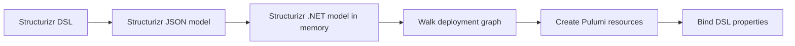
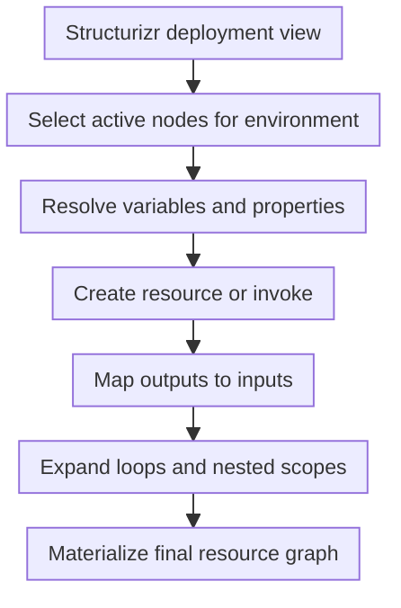
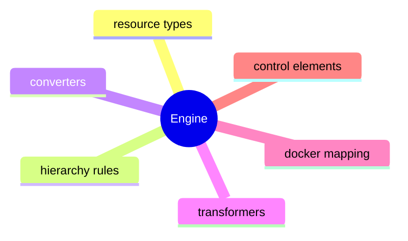

<style>
.engine-compare {
  display: grid;
  grid-template-columns: minmax(0, 1fr) minmax(0, 1fr);
  gap: 1rem;
  margin-top: 0.5rem;
}

.engine-compare > div {
  min-width: 0;
  position: relative;
}

.engine-compare pre {
  margin: 0 !important;
}

.engine-compare .shiki {
  font-size: 0.58rem !important;
  line-height: 1.15 !important;
  padding: 0.75rem !important;
}

.engine-compare .shiki code {
  display: flex;
  flex-direction: column;
}

.engine-compare .line {
  display: block;
  flex: 0 0 auto;
  width: calc(100% + 1.5rem);
  margin: 0 -0.75rem;
  padding: 0 0.75rem;
}

.engine-compare .line:first-child {
  margin-top: -0.75rem;
  padding-top: 0.75rem;
}

.engine-compare .line:last-child {
  margin-bottom: -0.75rem;
  padding-bottom: 0.75rem;
}

.engine-compare > div:first-child .line:nth-child(n + 1):nth-child(-n + 5),
.engine-compare > div:last-child .line:nth-child(n + 1):nth-child(-n + 5) {
  background-color: rgba(59, 130, 246, 0.1) !important;
}

.engine-compare > div:first-child .line:nth-child(n + 6):nth-child(-n + 16),
.engine-compare > div:last-child .line:nth-child(n + 6):nth-child(-n + 16) {
  background-color: rgba(34, 197, 94, 0.1) !important;
}

.engine-compare > div:first-child .line:nth-child(n + 17):nth-child(-n + 23),
.engine-compare > div:last-child .line:nth-child(n + 17):nth-child(-n + 23) {
  background-color: rgba(245, 158, 11, 0.1) !important;
}

.engine-compare > div:first-child .line:nth-child(n + 24),
.engine-compare > div:last-child .line:nth-child(n + 24) {
  background-color: rgba(236, 72, 153, 0.1) !important;
}
</style>

<div class="engine-compare"><div>

#### Structurizr DSL

```ts {all|1-5|6-16|17-23|24-32|none}{at:1}
sandbox = deploymentNode "Sandbox" {
  technology "azure-native:resources:getResourceGroup"
  properties {
    resourceGroupName     sandbox
  }
  testSa = infrastructureNode "Test Storage Account" {
    technology "azure-native:storage:StorageAccount"
    properties {
      accountName         testsa
      sku.name            Standard_LRS
      kind                StorageV2
    }
  }
 
 
 
  testMi = infrastructureNode "Test Managed Identity" {
    technology "azure-native:managedidentity:UserAssignedIdentity"
    properties {
      resourceName        test-mi
    }
 
 
    -> testSa "Contribute" "azure-native:authorization:RoleAssignment" {
      properties {
        principalType     ServicePrincipal
        roleDefinitionId  ${storageBlobDataContributor}
      }
    }
  }
}
```

</div>
<div>

#### Pulumi C#

```csharp {all|1-5|6-16|17-23|24-32|9,20-21,27,30}{at:1}
var sandbox = GetResourceGroup.Invoke(
  new GetResourceGroupInvokeArgs
  {
    ResourceGroupName   = "sandbox"
  });
var testSa = new StorageAccount("testSa",
  new StorageAccountArgs
  {
    ResourceGroupName   = sandbox.Apply(x => x.Name),
    AccountName         = "testsa",
    Sku = new SkuArgs
    {
      Name              = SkuName.Standard_LRS
    },
    Kind = Kind.StorageV2,
  });
var testMi = new UserAssignedIdentity("testMi",
  new UserAssignedIdentityArgs
  {
    ResourceGroupName   = sandbox.Apply(x => x.Name),
    Location            = sandbox.Apply(x => x.Location),
    ResourceName        = "test-mi"
  });
var testMiTestSaContribute = new RoleAssignment("testMiTestSaContrib",
  new RoleAssignmentArgs
  {
    PrincipalId         = testMi.PrincipalId,
    PrincipalType       = PrincipalType.ServicePrincipal,
    RoleDefinitionId    = storageBlobDataContributor,
    Scope               = testSa.Id
  });

```

</div>
</div>

<!--
On the left I have the deployment DSL.
On the right I have the Pulumi C# code.

And what I noticed was not that they were identical, because they are not.
What I noticed was that they were structurally similar enough.

In both cases I still describe:
- ⏭️ an existing resource group
- ⏭️ a storage account
- ⏭️ a managed identity
- ⏭️ and a role assignment between them

As you can see, DSL code is even shorter than the C# equivalent. ⏭️ Some properties may appear to be missing in the DSL, but they’re simply represented differently due to its hierarchical structure.

So the key thought was this:
if the deployment model already carries almost the same structure, maybe I can automate the translation instead of rewriting the same intent again in C#.
-->

---

# How I automated it

- Structurizr always converts the DSL into JSON
- that JSON is already available as a project artifact
- Structurizr provides a .NET package to load that JSON into memory
- so I could walk the deployment graph, create the declared Pulumi resources, and assign the properties from the DSL

<br/>



<!--
So how did I automate it.

The important realization was that I did not need to parse the DSL myself.
Structurizr already converts its DSL into JSON internally, and that JSON is always available in the project.

Then the next useful fact was that Structurizr already has packages for loading that JSON model in different languages, including .NET.

So in practice the job became much simpler than it may sound at first.
I could load the Structurizr JSON into memory, walk the deployment graph, create the Pulumi resources declared by the nodes, and bind the properties that were already present in the DSL.

So the engine did not begin as a complicated compiler.
It began as a graph walk over an existing model, with Pulumi used as the execution layer.
-->

---

<style>

.engine-does-diagram {
  display: flex;
  justify-content: center;
  width: 100%;
}

.engine-does-diagram .mermaid,
.engine-does-diagram svg {
  margin-left: auto !important;
  margin-right: auto !important;
}

</style>

# What the engine already does

<div class="grid grid-cols-2 gap-6 mt-4 items-start">
<div>

- creates new resources
- reads existing resources
- propagates parent values into child resources
- maps outputs into inputs through relationships
- supports transformers and converters
- expands `foreach` loops

</div>
<div>

<div class="engine-does-diagram">



</div>

</div>
</div>

<!--
So what that engine can actually do at the moment:
- create new resources.
- read existing resources.
- propagate parent values.
- map outputs to inputs through relationships.
- apply transformers and converters.
- expand foreach loops.
- create relationship-resources like role assignments.

So this is already more than a simple property mapper.
It is a small deployment engine that understands a set of deployment patterns.
-->

---

# Extensible by design

<div class="grid grid-cols-2 gap-6 mt-4 items-start">
<div>

### Pluggable parts

- resource type registry
- hierarchy propagation rules
- value converters
- named transformers
- docker image reference mapping
- provider-specific packages
</div>

<div class="flex flex-col h-full">

### Why that matters

- Azure is only the first provider package
- domain-specific patterns can be added later
- built-ins can be extended or overridden
- the core stays small but reusable

<br/>



</div>
</div>

<!--
The last thing I want to establish before going deeper is that I did not want the engine to be a one-off Azure script.

So I tried to keep the core small and make the important pieces replaceable.
- There are registries for resource types.
- There are propagation rules for hierarchy.
- There are converters and transformers.
- There is docker image mapping.
- Provider-specific functionality can live in separate packages.

That matters because I wanted this to be a reusable direction, not only a demo hardcoded for one exact stack.

So, I have shown the motivation for the engine.
Next I can start opening it up and explain how the translation actually works.
-->
