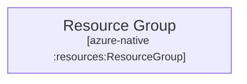
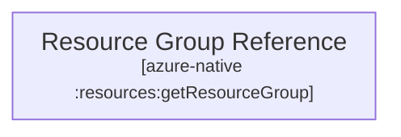
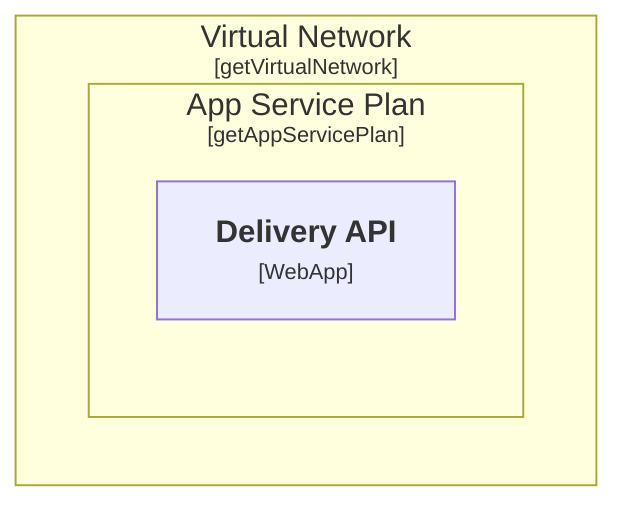
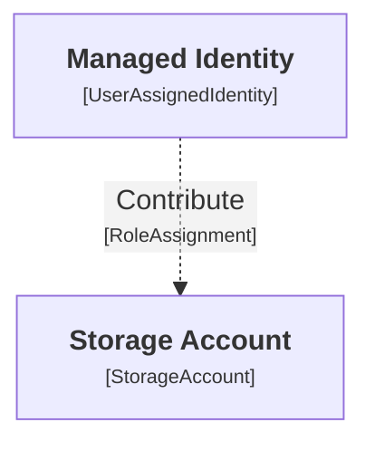

<style>
.patterns-grid .shiki,
.patterns-single .shiki {
  font-size: 0.58rem !important;
  line-height: 1.15 !important;
}

.patterns-grid pre,
.patterns-single pre {
  margin: 0 !important;
}
</style>

# Create or reference existing

<div class="grid grid-cols-2 gap-6 mt-4 patterns-grid items-start">
<div>

### Create a new resource

```ts {all|2|none}{at:1}
sharedRg = deploymentNode "Resource Group" {
  technology "azure-native:resources:ResourceGroup"
  properties {
    resourceGroupName ${RESOURCE_GROUP_NAME}
    location          ${LOCATION}
  }
}
```

<div class="patterns-diagram-center">


</div>

- create a real Azure resource
- properties become Pulumi inputs
- the model says this resource should exist

</div>
<div>

### Reference an existing resource

```ts {all|none|2}{at:1}
sharedRgReference = deploymentNode "Resource Group Reference" {
  technology "azure-native:resources:getResourceGroup"
  properties {
    resourceGroupName ${RESOURCE_GROUP_NAME}
  }
}
```

<div class="patterns-diagram-center">



</div>

- read an existing resource through provider invoke
- still keep it inside the same deployment model
- the model says this resource already exists

</div>
</div>

<!--
This is the first pattern I want to show.

The same deployment DSL can express two very different intents.
- ⏭️ On the left, I create a new resource group.
- ⏭️ On the right, I reference one that already exists.

That distinction matters because real environments are mixed.
Some things are created by this deployment.
Other things are shared, pre-existing, or owned somewhere else.

So the model is not only a list of things to create.
It can also describe the existing environment that new resources depend on.

It also makes it possible to split infrastructure into multiple modular slices instead of a single monolith. This approach is well supported by Structurizr deployment views, where you can control what is included in each view.
-->

---

# Parent context can flow down

<div class="patterns-compare-60-40 mt-4 patterns-grid items-start">
<div>

#### DSL

```ts
deploymentNode "Virtual Network" {
  technology "azure-native:network:getVirtualNetwork"
  properties {
    virtualNetworkName ${VNET_NAME}
  }
  deploymentNode "App Service Plan" {
    technology "azure-native:web:getAppServicePlan"
    properties {
      name ${ENV}-app-service-plan
    }
    containerInstance deliveryApi {
      properties {
        var "delivery-api"
        name          ${ENV}-delivery-api
      }
} } }
```

</div>
<div class="patterns-diagram-center">

#### Diagram



</div>
</div>

- parent resources contribute values to child resource arguments
- the child only needs to describe what is local and specific
- this removes a lot of repeated wiring such as resource group, location, or plan identity

<!--
The next pattern is hierarchy propagation.

A nested child node is not isolated.
It can inherit deployment context from its parents.
So the child only has to describe the values that are specific to itself.

That matters because cloud deployments are full of repeated wiring.
Resource group names, locations, plan IDs, network names, and similar values tend to reappear everywhere.

If the hierarchy already implies that context, I do not want to restate it manually on every child.

In this example, the Delivery API is modeled as an App Service that implicitly inherits its App Service Plan and Virtual Network from its parent resources.
-->

---

# Relationships can materialize resources

<div class="patterns-compare-70-30 mt-4 patterns-grid items-start">
<div>

### DSL

```ts
testMi = infrastructureNode "Test Managed Identity" {
  technology "azure-native:managedidentity:UserAssignedIdentity"
  properties {
    resourceName test-mi
  }
  -> testSa "Contribute" "azure-native:authorization:RoleAssignment" {
    properties {
      principalType    ServicePrincipal
      roleDefinitionId "${storageBlobDataContributor}"
    }
  }
}
```

</div>
<div class="patterns-diagram-center">

### Diagram



</div>
</div>

- the relationship is not just a label on a line
- it becomes a real `RoleAssignment` resource
- both ends of the relationship provide meaningful inputs such as principal and scope

<!--
This is one of the most important patterns in the engine.

The relationship is not only visual metadata.
It can become a real deployment resource.

In this example, the line between the managed identity and the storage account becomes a RoleAssignment.
So the model is expressing intent, not just drawing connectivity.

That is the key idea I wanted from this approach.
Relationships can carry enough meaning to influence the real deployment graph.
-->

---

# Inline property patterns

<div class="patterns-single mt-4">

```ts {all|4|5|6|7}
orderApiInstance = containerInstance orderApi {
  properties {
    var                              "order-api"
    name                             ${ENV}-order-api | upper
    siteConfig.appSettings:PORT      "8080"
    siteConfig.cors.allowedOrigins   "https://web.test.com,https://mobile.test.com | split ,"
    siteConfig.cors.allowedOrigins+= "https://api.test.com,https://delivery.test.com | split ,"
  }
}
```

</div>

- inline transformers can shape a value directly where it is assigned
- `<propertyPath>:<Key>` writes a value into a keyed entry such as `AppSettings`
- `+=` can append entries to a list-like value without rewriting the whole value

<!--
This slide shows the smaller property patterns that make the DSL practical.  
⏭️  
First, a value can be transformed inline.
Here the app name is turned into uppercase directly inside the property assignment.  
⏭️  
Second, the DSL can target keyed entries such as app settings.
That is what the colon syntax is doing here.  
⏭️  
And third, list-like values can first be set and ⏭️ then extended.
So I can define a base list of allowed origins and append more items later without rewriting the whole value.

These are small features, but they matter because they keep common deployment shaping logic close to the property that needs it.
-->

---

# Converters and transformers shape values

<div class="patterns-single mt-4">

```ts {all|5-8}
deliveryWorker = container "Delivery Worker" {
    technology "azure-native:web:WebApp"
    -> deliveryDb "uses" {
        properties {
            source  "name"
            target  "siteConfig.connectionStrings:DeliveryDatabase"
            format  "Server=tcp:${SQL_SERVER_NAME}.database.windows.net,1433;Initial Catalog={0}"
            converter "azure-sql-connection-string"
        }
    }
}
```

</div>

- the transformer shapes a simple source value into a full connection string
- the conversion layer binds it into the target `ConnectionStrings` structure
- the DSL stays short even when the provider input shape is more complex

<!--
This slide is about value shaping.

Sometimes the model has the right source value, but not yet in the exact format the provider expects.
⏭️
In this example, the source might only be a database name.
The transformer turns that into a real connection string.

Then the conversion layer binds that result into the more structured target input shape for the Web App.

That is the important point here.
The DSL can stay readable, while the engine handles the last mile of shaping and binding.
-->

---

### Repeat patterns with loops

```ts {all|1-2|3-12|13-18|19-25}
saName = deploymentNode "Foreach Storage Account in Config" {
  technology "foreach:loop"
  infrastructureNode "Source" {
    technology "foreach:source"
    -> saList "take" {
      properties {
        source "value"
        target "source"
        split  ","
      }
    }
  }
  sa = infrastructureNode "Storage Account" {
    technology "azure-native:storage:getStorageAccount"
    properties {
      accountName ${saName}
    }
  }
  prodMi -> sa "Contribute" "azure-native:authorization:RoleAssignment" {
    properties {
      var              order-service-${saName}-contributor
      roleDefinitionId ${storageBlobDataContributor}
      principalType    ServicePrincipal
    }
  }
}
```

<!--
The last pattern is repetition.

Sometimes the real deployment intent is not one resource, but the same small pattern repeated over a collection.  
⏭️ That is what the foreach loop gives me.

⏭️ The engine reads a source collection, creates one inner scope per item, and then ⏭️ materializes the nested resources inside each scope.
And importantly, that also includes ⏭️ relationship-resources like the role assignment here, pointing from a managed identity outside the loop.

So instead of copying the same block again and again, the model can express the pattern once and let the engine repeat it.
-->
